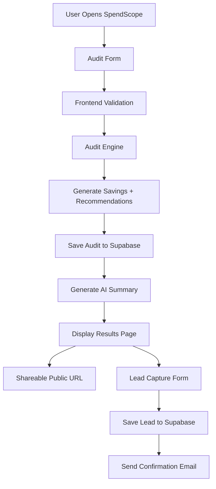

# Architecture Overview

SpendScope is a full-stack web application that analyzes AI tool spending and generates optimization recommendations for startups and teams.

The platform uses a React frontend, an Express backend, Supabase for storage, and OpenAI for AI-generated summaries.

---

# System Diagram

---

# Data Flow

## 1. User Input
The user enters:
- AI tools
- current plans
- monthly spend
- team size
- use case

The form state is stored in localStorage so data persists across refreshes.

---

## 2. Audit Engine
The frontend audit engine evaluates:
- whether the user is overpaying
- cheaper plans from the same provider
- possible alternative tools
- estimated savings opportunities

The audit logic uses rule-based pricing calculations instead of AI-generated financial analysis to keep recommendations predictable and explainable.

---

## 3. Database Storage
Audit results are stored in Supabase.

Each audit gets:
- unique ID
- shareable public URL
- savings data
- recommendation data

Personal information is stored separately from public audit data.

---

## 4. AI Summary Generation
The frontend sends audit details to the Express backend.

The backend calls the OpenAI API to generate a personalized audit summary.

If the AI request fails, the app falls back to a predefined summary template.

---

## 5. Lead Capture
After the audit is shown, users can optionally:
- save the report
- enter email/company details
- receive a confirmation email

Lead data is stored in Supabase.

---

# Stack Decisions

## React
React was chosen because it provides fast development, reusable components, and a smooth SPA experience for dashboard-style applications.

## TailwindCSS
TailwindCSS made it easier to build a modern responsive UI quickly without relying on prebuilt templates.

## Express.js
Express was used for lightweight backend APIs such as:
- AI summary generation
- transactional email handling

## Supabase
Supabase simplified backend development by providing:
- hosted PostgreSQL
- REST APIs
- real-time database workflows

## OpenAI API
OpenAI was used only for personalized summaries, while pricing logic remained deterministic and rule-based.

---

# Scalability Considerations

If the platform needed to support 10,000+ audits per day, I would improve the architecture by:

- moving audit processing into server-side services
- caching pricing data
- adding Redis for rate limiting and caching
- queueing AI summary generation jobs
- using background workers for email delivery
- introducing analytics pipelines
- adding database indexing and monitoring
- moving from simple rule files to managed pricing services

---

# Security & Abuse Protection

The platform uses:
- environment variables for secrets
- Supabase row-level security
- honeypot-based spam protection
- server-side API handling for AI and email requests

No API secrets are exposed in the frontend.