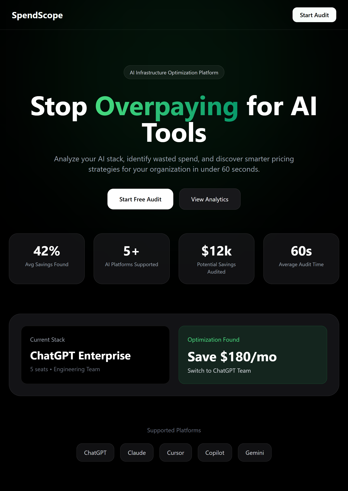
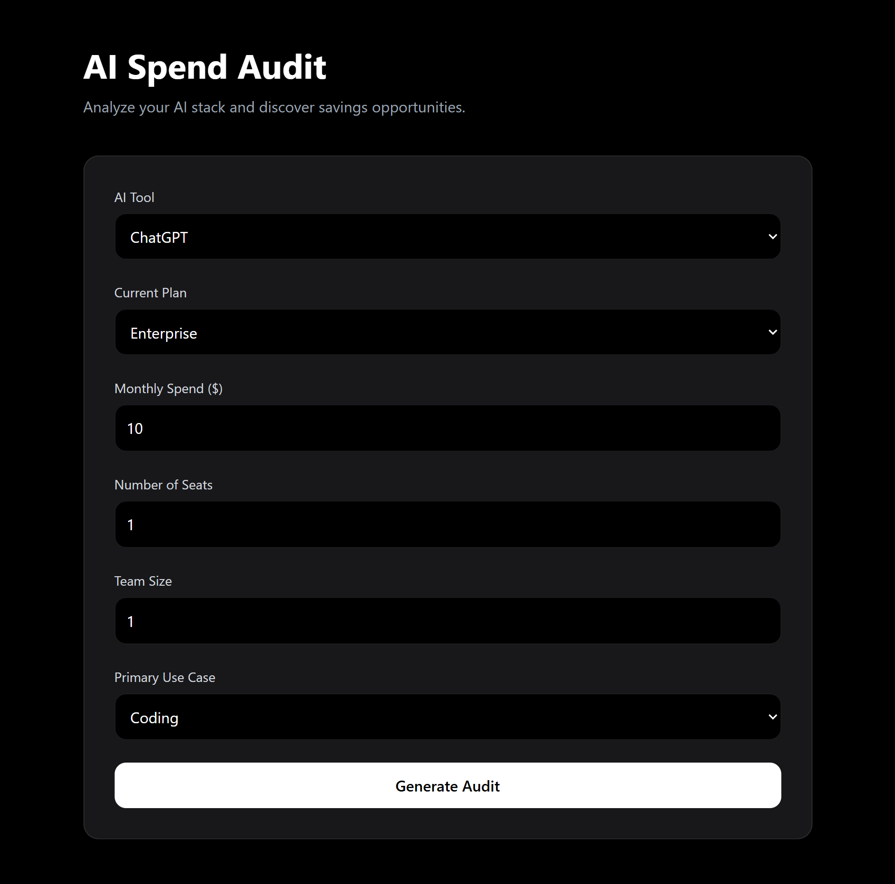
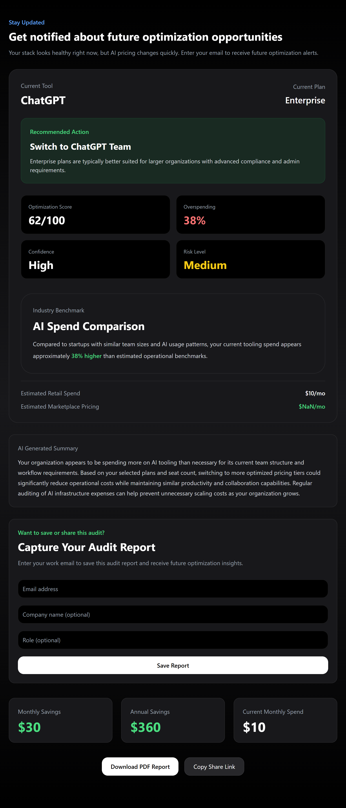
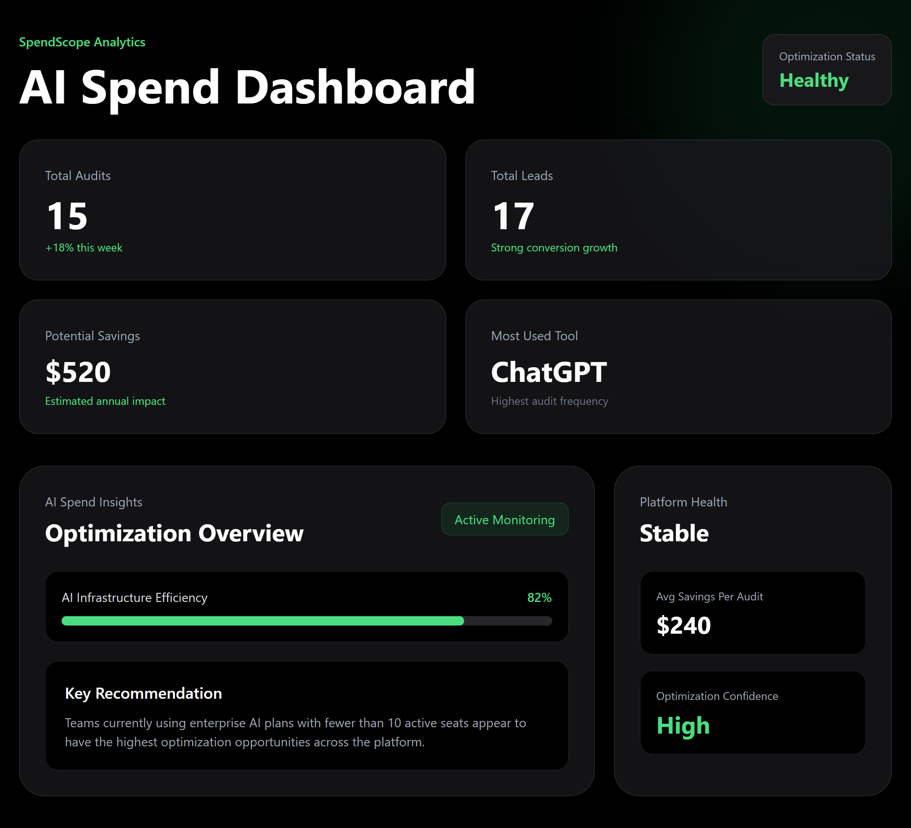

# SpendScope

SpendScope is a web app that helps startups and teams find unnecessary AI tool spending.

Users can enter the AI tools they use, their plans, monthly spend, and team size to get instant cost-saving recommendations, benchmark insights, and shareable audit reports.

---

# Live Demo

Frontend:
https://spend-scope-henna.vercel.app

Backend:
https://spendscope-u9ag.onrender.com

---

# Screenshots

## Homepage

---

## Audit Form

---

## Results Page

---

## Dashboard

---

# Features

- AI spend audit system
- AI-generated audit summaries
- Monthly and yearly savings estimates
- Benchmark spending insights
- Shareable audit links
- PDF export
- Lead capture form
- Email confirmation system
- Responsive dashboard
- Marketplace credit savings suggestions

---

# Supported Platforms

- ChatGPT
- Claude
- Cursor
- GitHub Copilot
- Gemini
- Anthropic API
- OpenAI API
- Windsurf

---

# Tech Stack

## Frontend
- React
- TailwindCSS
- React Router
- Axios
- jsPDF
- html2canvas

## Backend
- Node.js
- Express.js
- OpenAI API
- Resend

## Database
- Supabase

## Deployment
- Vercel
- Render

---

# Quick Start

## Frontend

cd frontend

npm install

npm run dev

---

## Backend

cd backend

npm install

node server.js

---

# Environment Variables

## Frontend

VITE_SUPABASE_URL=

VITE_SUPABASE_KEY=

---

## Backend

OPENAI_API_KEY=

RESEND_API_KEY=

---

# Decisions & Tradeoffs

## 1. JavaScript instead of TypeScript
I used JavaScript to move faster and focus more on building the product experience within the assignment timeline.

## 2. Rule-Based Audit Logic
I used fixed pricing rules instead of AI-generated financial analysis so recommendations stay predictable and explainable.

## 3. Supabase for Backend Storage
I chose Supabase because it simplified database setup and backend integration while still providing a real backend system.

## 4. No Authentication
I skipped authentication to keep the product simple and easy to share publicly.

## 5. Lightweight Spam Protection
I used a simple honeypot spam protection approach instead of CAPTCHA to reduce friction for users.

---

# Product Thinking

The goal was to build something that feels like a real SaaS product instead of a normal coding assignment.

Main focus areas:
- finding AI overspending
- giving useful recommendations
- making reports easy to share
- generating leads through free audits
- creating a clean Product Hunt-style experience

---

# AI Usage

AI was used for:
- personalized audit summaries
- UI/content improvements
- debugging help
- prompt testing

The actual audit calculations and pricing recommendations use rule-based logic instead of AI.

---

# Deployment

Frontend:
https://spend-scope-henna.vercel.app

Backend:
https://spendscope-u9ag.onrender.com/

---

# Lighthouse Goals

The project was optimized for:
- Performance ≥ 85
- Accessibility ≥ 90
- Best Practices ≥ 90

---

# Future Improvements

- live pricing APIs
- organization accounts
- advanced analytics
- referral system
- embeddable widgets
- team collaboration
- audit history tracking